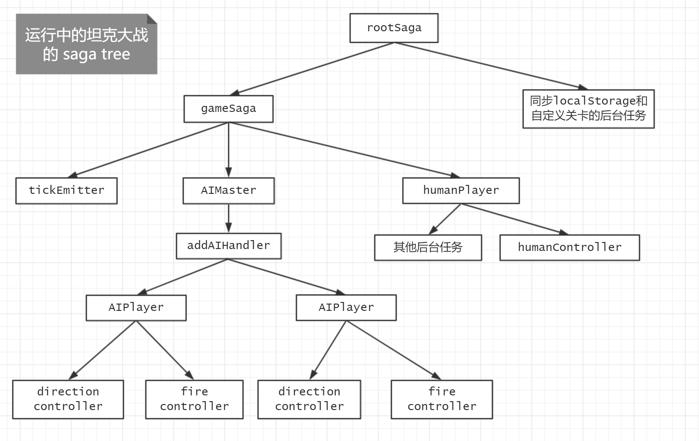

# Building Your Own Redux-Saga

知乎上已经有不少介绍 redux-saga 的好文章了，例如[redux-saga 实践总结](https://zhuanlan.zhihu.com/p/23012870)、[浅析redux-saga实现原理](https://zhuanlan.zhihu.com/p/30098155)、[Redux-Saga 漫谈](https://zhuanlan.zhihu.com/p/35437092)。本文不讨论 redux-saga 的使用方式，而是介绍其实现原理，并一步步地用代码构建 little-saga —— 一个 redux-saga 的简单版本。

几乎所有（对的，就是几乎所有 =。=）的 little-saga 代码都参考了 redux-saga，参考的版本为 redux-saga v1.0.0-beta.1。redux-saga 对许多边界情况做了处理，部分代码比较晦涩，而 little-saga 则进行了大量简化，所以两者有不少不同的实现细节。本文中出现的代码都是 little-saga 的，不过我偶尔也会附上相应的 redux-saga 源码链接，大家可以对照着看。

## (todo) 名词解释

(todo) 将 iter 重命名为 iterator; effect-producer; effect-runner; effects 消费者直接使用 redux-saga 时，redux-saga 是消费者，而我们的代码一直充当着 effects 生产者的角色。

很多时候也可以将 redux-saga 看作一种「请求-响应」模型，我们业务代码生产 effects 以发起「请求」，而 redux-saga 负责消费这些 effects 并将响应返回给业务代码。

saga实例 / saga函数 / task

## 1.1 生成器与 for-of 循环

```javascript
function* range(start, end) {
  for (let i = start; i < end; i++) {
    yield i
  }
}

for (let x of range(1, 10)) {
  console.log(x)
}
// 输出 1, 2, 3 ... 8, 9
```

(todo) for-of 循环做了什么？ 什么是迭代器？ 什么是生成器？

http://www.infoq.com/cn/articles/es6-in-depth-iterators-and-the-for-of-loop

http://www.infoq.com/cn/articles/es6-in-depth-generators?utm_source=articles_about_ES6-In-Depth&utm_medium=link&utm_campaign=ES6-In-Depth

## 1.2 使用 while-true 来消费迭代器

如果我们不用 for-of，而是自己实现消费者，那么代码如下：

```javascript
const iter = range(1, 10)
while (true) {
  const { done, value } = iter.next()
  if (done) {
    break
  }
  console.log(value)
}
// 输出 1, 2, 3 ... 8, 9
```

(todo) 代码执行的顺序的说明

## 1.3 使用递归函数异步消费迭代器

每次调用 iter.next() 都可以从生产者中取回一个结果；上面的例子中我们用了 while-true 循环，所有的代码都是同步的；这一次我们利用 setTimeout 使得前后两次调用 iter.next() 之间有一定的间隔。为了实现在不同时刻调用 iter.next()，我们也将驱动函数 next 写成了递归的形式。(todo) 这里是否需要将 `arg` 写出来？

```javascript
const iter = range(1, 10)

function next(arg) {
  const { done, value } = iter.next(arg)
  if (done) {
    return
  }
  console.log(value)
  setTimeout(next, value * 100)
}
next()
// 陆续输出 1, 2, 3 ... 8, 9
// 前后两个数字输出之间有一定的时间间隔，且数字越大输出间隔越长
```

(todo)为什么使用生成器(yield)，而不是使用 aynsc/await？或者说与async/await相比，生成器有什么优势？

## 1.4 双向通信

在 redux-saga 中，我们往往需要使用 yield 语句的返回值，返回值的含义取决于 effect 的类型。例如下面这个例子（注意这个例子需要依赖于 redux-saga，不能像其他例子那样直接运行在浏览器中）：

```javascript
function* generatorInReduxSaga() {
  const response = yield fetch('https://example.com/')
  const action = yield take('SOME_ACTION')
  const raceResult = yield race({ a: effect1, b: effect2 })
}
```

为了实现双向通信，effect-runner 要提供合适的参数来调用 `iter.next(arg)` 。当 `iter.next(arg)` 被调用是，参数 arg 将会作为 `yield xxx` 语句的返回值，且暂停的迭代器会继续执行（直到遇到下一个 yield 语句）。为此我们修改前面的代码如下：

```javascript
const iter = range(1, 10)

function next(arg) {
  // 注意驱动函数多了参数 arg
  // 这里我们将 arg 作为参数传递给 iter.next，作为 effect-producer 中 yield 语句的返回值
  const { done, value } = iter.next(arg)
  if (done) {
    return
  }
  console.log(value)
  // 在这个简单的例子中，我们的 effect-runner 忽略了 yield 语句的返回值
  // 所以 ??? 处的参数现在似乎还没什么意义……
  setTimeout(() => next(/* ??? */), value * 100)
}
next()
// 陆续输出 1, 2, 3 ... 8, 9
// 前后两个数字输出之间有一定的时间间隔，且数字越大输出间隔越长
```

## 1.5 effect 的类型与含义

前面的例子中我们的 effect-producer 都是简单的 range，effect（即被 yield 的值）为数字。因为数字没有什么确切的含义，effect-runner 只是简单地打印这些数字，然后再在合适地时刻调用 `iterator.next(arg)`。

如果 effect 有明确的含义，effect-runner 就可以根据其含义来决定具体的执行逻辑。redux-saga 可以处理 promise、iterator、take、put 等类型的 effect，合理地组合不同类型的 effect 可以表达非常复杂的异步逻辑（例如 [坦克大战](https://zhuanlan.zhihu.com/p/35551654) 的游戏逻辑）。下面我们给 little-saga 加上一些简单的 effect 的处理能力。

```javascript
function* gen() {
  console.log('enter ...')
  const a = yield ['promise', fetch('/')]
  console.assert(a instanceof Response)
  const b = yield ['delay', 500]
  console.assert(b === '500ms elapsed')
  const c = yield ['ping']
  console.assert(c === 'pong')
  console.log('exit ... ')
}

const iterator = gen()

function next(arg, isErr) {
  // 注意驱动函数多了参数 isErr，用来表示是否发生了错误
  // 不过我们在这里先忽略isErr为true的情况
  const { done, value } = iterator.next(arg)
  if (done) {
    return
  }
  // console.log(value) 不打印 value，而是根据 value 的含义执行相应的处理逻辑
  if (value[0] === 'promise') {
    const promise = value[1]
    promise.then(resolvedValue => next(resolvedValue), error => next(error, true))
  } else if (value[0] === 'delay') {
    const timeout = value[1]
    setTimeout(() => next(`${timeout}ms elapsed`), timeout)
  } else if (value[0] === 'ping') {
    next('pong')
  } else {
    iter.throw(new Error('无法识别的 effect'))
  }
}
next() // kick start!
```

在 redux-saga 中，effect 是一个由[函数 effect](https://github.com/redux-saga/redux-saga/blob/v1.0.0-beta.1/packages/core/src/internal/io.js#L24) 生成、`[IO]` 字段为 `true` 的对象。little-saga 使用数组来表示 effect；数组的第一个元素为字符串，用于表示 effect 的类型，剩余元素为 effect 的参数。

(todo) 前面几个小节介绍了 ES2015 生成器的特性，如果约定一些常见的 effect 类型，并恰当使用这些类型的话，可以用生成器语法写出富有表达力的代码。

## 1.6 redux-saga callback style

在 Node.js 中，异步回调函数往往使用 error-first 的模式：第一个参数为 err，如果一个异步操作发生了错误，那么错误会通过 err 参数传递回来；第二个参数用于传递正确的操作结果，如果异步操作没有发生错误，那么操作结果会通过该参数进行传递。error-first 模式大量用于 node 核心模块（例如 [fs 模块](https://nodejs.org/dist/latest-v8.x/docs/api/fs.html)）和第三方库（例如 [async 模块](http://caolan.github.io/async/)），可以阅读[该文章](http://fredkschott.com/post/2014/03/understanding-error-first-callbacks-in-node-js/)了解更多信息。

而在 redux-saga 中，异步回调函数的第一个参数是操作结果，第二个参数是一个布尔值，表示是否发生了错误。我们称该风格为 redux-saga callback style，其类型信息用 TypeScript 表示如下：

```typescript
type Callback = (result: any, isErr: boolean) => void
```

redux-saga 源码中存在着大量该风格的回调函数，相应的变量名也有好几个：`cont` / `cb` / `currCb`。仅在 [proc.js 文件中](https://github.com/redux-saga/redux-saga/blob/v1.0.0-beta.1/packages/core/src/internal/proc.js)进行搜索，这些变量名也出现了 50 多次。在后面的代码中，我们都将使用该风格来实现 little-saga。

## 1.7 cancellation

redux-saga 的一大特点就是 effects 是可取消的，并且支持使用 try-catch-finally 的语法将清理逻辑放在 finally 语句块中。官方文档中也对[任务取消](https://redux-saga.js.org/docs/advanced/TaskCancellation.html)做了说明。

在 redux-saga 具体实现中，调用者（caller）会将回调函数 cb 传递给被调用者（callee），当 callee 完成异步任务时，调用 cb 来把结果告诉给 caller。而 cancellation 机制是这么实现的：如果一个操作是可取消的话，callee 需要将「取消时的逻辑」放在 cb.cancel 上，这样一来当 caller 想要取消该异步操作时，直接调用 cb.cancel() 即可。

文章[如何取消你的 Promise？](https://juejin.im/post/5a32705a6fb9a045117127fa)中也提到了多种取消 Promise 的方法，其中生成器是最具扩展性的方式，有兴趣的同学可以了解一下

## 1.8 digestEffect

一个 Promise 一旦 resolve/reject 之后，就不能再改变状态了。一个 effect 也是类似，一旦完成或是被取消，就不能再改变状态，「完成时的回调函数」和「被取消时的回调函数」加起来只能最多被调用一次。也就是说，effect 的「完成」和「被取消」是互斥的。函数 digestEffect 用变量 effectSettled 记录了一个 effect 是否已经 settled，保证了上述互斥性。digestEffect 也调用了 normalizeEffect 来规范化 effect，这样一来，对于 promise/iterator，我们可以在 effect-producer 直接 yield 这些对象，而不需要将它们包裹在数组中。

```javascript
const noop = () => null
const is = {
  func: /* 判断参数是否函数 */
  string: /* 判断参数是否字符串 */
  /* ...... */
}

function digestEffect(rawEffect, cb) {
  let effectSettled = false

  function currCb(res, isErr) {
    if (effectSettled) {
      return
    }
    effectSettled = true
    cb.cancel = noop
    cb(res, isErr)
  }
  currCb.cancel = noop

  cb.cancel = () => {
    if (effectSettled) {
      return
    }
    effectSettled = true
    try {
      currCb.cancel()
    } catch (err) {
      console.error(err)
    }
    currCb.cancel = noop
  }

  runEffect(normalizeEffect(rawEffect), currCb)
}

function normalizeEffect(effect) {
  if (is.string(effect)) {
    return [effect]
  } else if (is.promise(effect)) {
    return ['promise', effect]
  } else if (is.iterator(effect)) {
    return ['iterator', effect]
  } else if (is.array(effect)) {
    return effect
  } else {
    throw new Error('Unable to normalize effect')
  }
}
```

## 1.9 (todo) proc 初步实现

```javascript
const TASK_CANCEL = Symbol('TASK_CANCEL')
const CANCEL = Symbol('CANCEL')

function proc(iterator, parentContext, cont) {
  cont.cancel = cancel
  next()

  // return task 这里需要返回一个 Task 对象

  function next(arg, isErr) {
    try {
      let result
      if (isErr) {
        result = iterator.throw(arg)
      } else if (arg === TASK_CANCEL) {
        next.cancel()
        result = iterator.return(TASK_CANCEL)
      } else {
        result = iterator.next(arg)
      }

      if (!result.done) {
        digestEffect(result.value, next)
      } else {
        cont(result.value)
      }
    } catch (error) {
      cont(error, true)
    }
  }
  
  function digestEffect(rawEffect, cb) { /* 参见 1.8 digestEffect */ }
  function normalizeEffect(effect) { /* 参见 1.8 digestEffect */ }

  function cancel() {
    cont(TASK_CANCEL)
  }

  function runEffect(effect, currCb) {
    const effectType = effect[0]
    if (effectType === 'promise') {
      resolvePromise(effect, ctx, currCb)
    } else if (effectType === 'iterator') {
      resolveIterator(iterator, ctx, currCb)
    } else {
      throw new Error('Unknown effect type')
    }
  }

  function resolvePromise([effectType, promise], ctx, cb) {
    const cancelPromise = promise[CANCEL]
    if (is.func(cancelPromise)) {
      cb.cancel = cancelPromise
    }
    promise.then(cb, error => cb(error, true))
  }

  function resolveIterator([effectType, iterator], ctx, cb) {
    proc(iterator, ctx, cb)
  }
}
```


## 2.1 Task

[proc函数](https://github.com/redux-saga/redux-saga/blob/v1.0.0-beta.1/packages/core/src/internal/proc.js#L173) 用于运行一个迭代器，并返回一个 Task 对象。Task 对象描述了该迭代器的运行状态，我们首先来看看 Task 的接口（使用 TypeScript 来表示类型信息）。在 little-saga中，我们将使用相同的 Task 接口。

```typescript
type Callback = (result: any, isErr: boolean) => void
type Joiner = { task: Task; cb: Callback }

interface Task {
  [TASK]: true
  toPromise(): Promise<any>
  cont: Callback
  joiners: Joiner[]
	cancel(): void
  isRunning(): boolean
  isCancelled(): boolean
  isAborted(): boolean
  result(): any
  error(): Error
}
```

迭代器/saga实例在运行时，内部逻辑也许非常复杂，不过从外界看来，迭代器最终只返回一个异步结果。仅从返回值的角度看，我们用一个 Promise 就可以表示saga实例。Task 对象包含了 `toPromise()` 方法，该方法会返回saga实例对应的promise。在其他方面，saga实例的功能是要比Promise丰富的：`Task#cancel()` 方法使得saga实例允许被取消；`Task#isXXX()` 等方法可以查询saga实例的运行状态；`Task#result()` / `Task#error()` 方法可以获得saga实例的结果。

(todo)async函数调用后，内部逻辑也许非常复杂，不过从调用者的角度看，一个 Promise 对象就……。

## 2.2 fork model

redux-saga 提供了 fork effect 来进行非阻塞调用，`yield fork(...)` 会返回一个 Task 对象，用于表示在后台执行的 saga 实例。在更普遍的情况下，一个 saga 实例在运行的时候会多次 yield fork effect，那么一个 parent-saga 实例就会有多个child-saga。rootSaga 通过 `sagaMiddleware.run()` 开始运行，在 rootSaga 运行过程中，会 fork 得到若干个 child-saga，每一个 child-saga 又会 fork 得到若干个 grandchild-saga，如果我们将所有的 parent-child 关系绘制出来的话，我们可以得到类似于下图这样的一棵 saga 树。



redux-saga 的文档也[对 fork model 进行了详细的说明](https://redux-saga.js.org/docs/advanced/ForkModel.html)，下面我做一点简单的翻译：

* 完成：一个 saga 实例在满足以下条件之后进入完成状态:
  1. 迭代器自身的语句执行完成
  2. 所有的 child-saga 进入完成状态
* 错误传播：一个 saga 实例在以下情况会中断并抛出错误：
  1. 迭代器自身执行时抛出了异常
  2. 其中一个 child-saga 抛出了错误
* 取消：取消一个 saga 实例也会导致以下事情的发生：
  1. 取消 mainTask，也就是取消当前 saga 实例等待的 effect
  2. 取消所有仍在执行的 child-saga

用一些坦克大战的例子来说明上面三个规则：

* 完成：当 gameSaga 迭代器自身的代码执行完毕，并且 tickEmitter/AIMaster/humanPlayer 这三个 child-saga 完成时，gameSaga 进入完成状态。而 AIMaster 的完成也意味着 addAIHandler 的完成，addAIHandler 的完成意味着所有的 AIPlayer 的完成。**当一个节点的所有子节点完成时，且自身迭代器代码执行完毕时，该节点才算完成。**
* 错误传播：假设 AIPlayer 发生错误，那么 addAIHandler 会收到该错误；假设 addAIHandler 无法处理该错误，该错误就会传播给 AIMaster。**当一个节点发生错误时，错误会沿着树向根节点向上传播，直到某个某个节点捕获该错误。**
* 取消：gameSaga 被取消时，tickEmitter/AIMaster/humanPlayer 会同时被取消，而取消 AIMaster 被取消时，AIHandler 会被同时取消。**取消一个节点时，该节点对应的整个子树都将被取消。**

## 2.3 fork-queue

fork-queue 是 fork model 的具体实现。redux-saga 使用了 [forkQueue](https://github.com/redux-saga/redux-saga/blob/v1.0.0-beta.1/packages/core/src/internal/proc.js#L73) 来实现，在 little-saga 中我们将使用同样的做法。

每一个 saga 实例可以用一个 Task 对象进行描述，为了实现 fork model，每一个 saga 实例开始运行时，我们需要用一个数组来保存 child-tasks。我们来看看 forkQueue 的接口：

```typescript
interface intefaceOfFunctionForkQueue {
  (mainTask: MainTask, cb: Callback): {
    addTask(task: Task): void
    cancelAll(): void
    abort(err: Error): void
  }
}
```

函数 `forkQueue` 接受两个参数，参数 `mainTask` 代表当前迭代器自身代码的执行状态，参数 `cb` 是整个 fork-queue 的回调函数。当所有的 child-task 以及 mainTask 都完成时，我们需要调用 `cb` 来通知其 parent-saga（对应于 *2.2 fork model中的「完成」*）。

函数 `forkQueue` 返回的对象包含三个方法。方法 `addTask` 用于向 fork-queue 中添加新的 child-task；方法 `cancelAll` 用于取消所有的 child-task；而方法 `abort` 不仅会取消所有的 child-task，还会调用 `cb` 向 parent-saga 通知错误。

little-saga 的 forkQueue 实现如下（redux-saga 的简化版本）：

```javascript
function forkQueue(mainTask, cb) {
  let tasks = []
  let result
  // 使用completed变量来保证「完成」与「出错」的互斥
  let completed = false

  // mainTask 一开始就会被添加到 forkQueue 中
  addTask(mainTask)

  // 取消所有的child-task，并向上层通知错误
  function abort(err) {
    cancelAll()
    cb(err, true)
  }

  function addTask(task) {
    // 往数组中添加child-task
    tasks.push(task)
    // 指定child-task完成时的行为……
    task.cont = (res, isErr) => {
      if (completed) {
        return
      }
      // 从数组中移除该child-task
      remove(tasks, task)
      // 清空child-task完成时的行为，这是一个防止出错的做法
      task.cont = noop
      if (isErr) {
        // 某一个child-task发生了错误，调用abort来进行「错误传播」
        abort(res)
      } else {
        // 如果是mainTask完成的话，记录其结果
        if (task === mainTask) {
          result = res
        }
        if (tasks.length === 0) {
          // 满足了saga实例完成的两个条件
          completed = true
          cb(result)
        }
      }
    }
  }

  function cancelAll() {
    if (completed) {
      return
    }
    completed = true
    // 依次调用child-task的cancel方法，进行「级联取消」，并清空child-task完成时的行为
    tasks.forEach(t => {
      t.cont = noop
      t.cancel()
    })
    tasks = []
  }

  return {
    addTask,
    cancelAll,
    abort,
  }
}
```

## 2.4 context

每一个 task 都有其对应的 context 对象，用于保存该 task 运行时的上下文信息。在 redux-saga 中我们可以使用 getContext/setContext 读写该对象。context 的一大特性是 child-task 会使用原型链的方式继承 parent-task context。当尝试访问 context 中的某个属性时，不仅会在当前 task context 对象中搜寻该属性，也会在 parent-task context 对象进行搜索，以及 parent-task 的 parent-task，依次层层往上搜索，直到找到该属性或是到达 rootSaga。该「继承」在 [redux-saga 中的实现](https://github.com/redux-saga/redux-saga/blob/v1.0.0-beta.1/packages/core/src/internal/proc.js#L194)也非常简单，只有一行代码：`const taskContext = Object.create(parentContext)`。

context 是一个强大的机制，然而在 redux-saga 中似乎很少被提起。在 React 中，React context 用途非常广泛，react-redux / react-router 等相关类库都是基于该机制实现的。在 little-saga 中，我们将充分利用 context 机制，并使用该机制实现「effect 类型拓展」、「stdChannel」、「连接 redux store」等功能。这些机制的实现会在本文后面提到。

## 2.5 (todo)proc 详解

## 2.6 effect 类型拓展

## 2.7 race/all effect

## 2.8 channel 与 take/put effect

## 3.1 (todo)scheduler