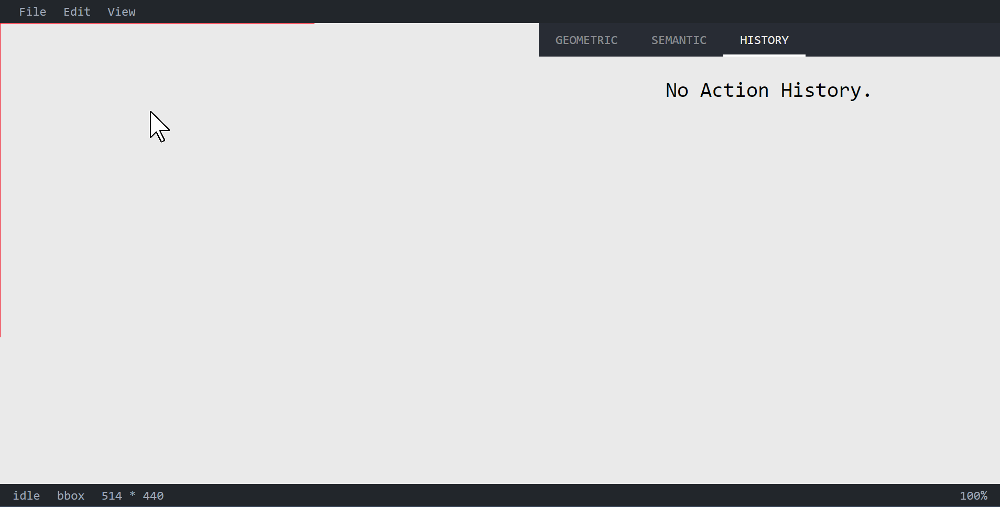

# 基于 Immutable.js 实现撤销重做功能

浏览器的功能越来越强大，许多原来由其他客户端提供的功能渐渐转移到了前端，前端应用也越来越复杂。许多前端应用，尤其是一些在线编辑软件，运行时需要不断处理用户的交互，提供了撤消重做功能来保证交互的流畅性。不过为一个应用实现撤销重做功能并不是一件容易的事情。[Redux 官方文档中](https://redux.js.org/recipes/implementing-undo-history) 介绍了如何在 redux 应用中实现撤销重做功能。基于 redux 的撤销功能是一个自顶向下的方案：引入 redux-undo 之后所有的操作都变为了「可撤销的」，然后我们不断修改其配置使得撤销功能变得越来越好用（我猜这也是 [redux-undo 有那么多配置项](https://github.com/omnidan/redux-undo#configuration) 的原因)。

本文将采用自底向上的思路，以一个简易的在线画图工具为例子，使用 [TypeScript](https://www.typescriptlang.org/)、[Immutable.js](https://facebook.github.io/immutable-js/) 实现一个实用的「撤消重做」功能。大致效果如下图所示：



上图看不清的话，可以看[这里](https://raw.githubusercontent.com/shinima/shinima.github.io/master/articles/practical-undo-redo/redo-undo.gif)。下面的 TypeScript 代码缺少语法高亮的话，可以看[这里](https://github.com/shinima/shinima.github.io/tree/master/articles/practical-undo-redo)。

## 第一步：确定哪些状态需要历史记录，创建自定义的 State 类

并非所有的状态都需要历史记录。许多状态是非常琐碎的，尤其是一些与鼠标或者键盘交互相关的状态，例如在画图工具中拖拽一个图形时我们需要设置一个「正在进行拖拽」的标记，页面会根据该标记显示对应的拖拽提示，显然该拖拽标记不应该出现在历史记录中；而另一些状态无法被撤销或是不需要被撤销，例如网页窗口大小，向后台发送过的请求列表等。

排除那些不需要历史记录的状态，我们将剩下的状态用 Immutable Record 封装起来，并定义 State 类：

```typescript
// State.ts
import { Record, List, Set } from 'immutable'

const StateRecord = Record({
  items: List<Item>
  transform: d3.ZoomTransform
  selection: number
})

// 用类封装，便于书写 TypeScript，注意这里最好使用Immutable 4.0 以上的版本
export default class State extends StateRecord {}
```

这里我们的例子是一个简易的在线画图工具，所以上面的 State 类中包含了三个字段，items 用来记录已经绘制的图形，transform 用来记录画板的平移和缩放状态，selection 则表示目前选中的图形的 ID。而画图工具中的其他状态，例如图形绘制预览，自动对齐配置，操作提示文本等，则没有放在 State 类中。

## 第二步：定义 Action 基类，并为每种不同的操作创建对应的 Action 子类

与 redux-undo 不同的是，我们仍然采用[命令模式](https://en.wikipedia.org/wiki/Command_pattern)：定义基类 Action，所有对 State 的操作都被封装为一个 Action 的实例；定义若干 Action 的子类，对应于不同类型的操作。

在 TypeScript 中，Action 基类用 Abstract Class 来定义比较方便。

```typescript
// actions/index.ts
export default abstract class Action {
  abstract next(state: State): State
  abstract prev(state: State): State

  prepare(appHistory: AppHistory): AppHistory {
    return appHistory
  }
  getMessage() {
    return this.constructor.name
  }
}
```

Action 对象的 next 方法用来计算「下一个状态」，prev 方法用来计算「上一个状态」。getMessage 方法用来获取 Action 对象的简短描述。通过 getMessage 方法，我们可以将用户的操作记录显示在页面上，让用户更方便地了解最近发生了什么。prepare 方法用来在 Action 第一次被应用之前，使其「准备好」，AppHistory 的定义在本文后面会给出。

**Action 子类举例**

下面的 AddItemAction 是一个典型的 Action 子类，用于表达「添加一个新的图形」。

```typescript
// actions/AddItemAction.ts
export default class AddItemAction extends Action {
  newItem: Item
  prevSelection: number

  constructor(newItem: Item) {
    super()
    this.newItem = newItem
  }

  prepare(history: AppHistory) {
    // 创建新的图形后会自动选中该图形，为了使得撤销该操作时 state.selection 变为原来的值
    // prepare 方法中读取了「添加图形之前 selection 的值」并保存到 this.prevSelection
    this.prevSelection = history.state.selection
    return history
  }

  next(state: State) {
    return state.setIn(['items', this.newItem.id], this.newItem).set('selection', this.newItemId)
  }

  prev(state: State) {
    return state.deleteIn(['items', this.newItem.id]).set('selection', this.prevSelection)
  }

  getMessage() {
    return `Add item ${this.newItem.id}`
  }
}
```

**运行时行为**

应用运行时，用户交互产生一个 Action 流，每次产生 Action 对象时，我们调用该对象的 next 方法来计算后一个状态，然后将该 action 保存到一个列表中以备后用；用户进行撤销操作时，我们从 action 列表中取出最近一个 Action 并调用其 prev 方法。应用运行时，next/prev 方法被调用的情况大致如下：

```
// initState 是一开始就给定的应用初始状态
// 某一时刻，用户交互产生了 action1 ...
state1 = action1.next(initState)
// 又一个时刻，用户交互产生了 action2 ...
state2 = action2.next(state1)
// 同样的，action3也出现了 ...
state3 = action3.next(state2)

// 用户进行撤销，此时我们需要调用最近一个action的prev方法
state4 = action3.prev(state3)
// 如果再次进行撤销，我们从action列表中取出对应的action，调用其prev方法
state5 = action2.prev(state4)

// 重做的时候，取出最近一个被撤销的action，调用其next方法
state6 = action2.next(state5)
```

**Applied-Action**

为了方便后面的说明，我们对 Applied-Action 进行一个简单的定义：Applied-Action 是指那些操作结果已经反映在当前应用状态中的 action；当 action 的 next 方法执行时，该 action 变为 applied；当 prev 方法被执行时，该 action 变为 unapplied。

## 第三步：创建历史记录容器 AppHistory

前面的 State 类用于表示某个时刻应用的状态，接下来我们定义 AppHistory 类用来表示应用的历史记录。同样的，我们仍然使用 Immutable Record 来定义历史记录。其中 state 字段用来表达当前的应用状态，list 字段用来存放所有的 action，而 index 字段用来记录最近的 applied-action 的下标。应用的历史状态可以通过 undo/redo 方法计算得到。apply 方法用来向 AppHistory 中添加并执行具体的 Action。具体代码如下：

```typescript
// AppHistory.ts
const emptyAction = Symbol('empty-action')
export const undo = Symbol('undo')
export type undo = typeof undo // TypeScript2.7之后对symbol的支持大大增强
export const redo = Symbol('redo')
export type redo = typeof redo

const AppHistoryRecord = Record({
  // 当前应用状态
  state: new State(),
  // action 列表
  list: List<Action>(),
  // index 表示最后一个applied-action在list中的下标。-1 表示没有任何applied-action
  index: -1,
})

export default class AppHistory extends AppHistoryRecord {
  pop() {
    // 移除最后一项操作记录
    return this.update('list', list => list.splice(this.index, 1)).update('index', x => x - 1)
  }
  getLastAction() {
    return this.index === -1 ? emptyAction : this.list.get(this.index)
  }
  getNextAction() {
    return this.list.get(this.index + 1, emptyAction)
  }

  apply(action: Action) {
    if (action === emptyAction) return this
    return this.merge({
      list: this.list.setSize(this.index + 1).push(action),
      index: this.index + 1,
      state: action.next(this.state),
    })
  }

  redo() {
    const action = this.getNextAction()
    if (action === emptyAction) return this
    return this.merge({
      list: this.list,
      index: this.index + 1,
      state: action.next(this.state),
    })
  }

  undo() {
    const action = this.getLastAction()
    if (action === emptyAction) return this
    return this.merge({
      list: this.list,
      index: this.index - 1,
      state: action.prev(this.state),
    })
  }
}
```

## 第四步：添加「撤销重做」功能

假设应用中的其他代码已经将网页上的交互转换为了一系列的 Action 对象，那么给应用添上「撤销重做」功能的大致代码如下：

```typescript
type HybridAction = undo | redo | Action

// 如果用Redux来管理状态，那么使用下面的reudcer来管理那些「需要历史记录的状态」
// 然后将该reducer放在应用状态树中合适的位置
function reducer(history: AppHistory, action: HybridAction): AppHistory {
  if (action === undo) {
    return history.undo()
  } else if (action === redo) {
    return history.redo()
  } else {
    // 常规的 Action
    // 注意这里需要调用prepare方法，好让该action「准备好」
    return action.prepare(history).apply(action)
  }
}

// 如果是在 Stream/Observable 的环境下，那么像下面这样使用 reducer
const action$: Stream<HybridAction> = generatedFromUserInteraction
const appHistory$: Stream<AppHistory> = action$.fold(reducer, new AppHistory())
const state$ = appHistory$.map(h => h.state)

// 如果是用回调函数的话，大概像这样使用reducer
onActionHappen = function(action: HybridAction) {
  const nextHistory = reducer(getLastHistory(), action)
  updateAppHistory(nextHistory)
  updateState(nextHistory.state)
}
```

## 第五步：合并 Action，完善用户交互体验

通过上面这四个步骤，画图工具拥有了撤消重做功能，但是该功能用户体验并不好。在画图工具中拖动一个图形时，MoveItemAction 的产生频率和 mousemove 事件的发生频率相同，如果我们不对该情况进行处理，MoveItemAction 马上会污染整个历史记录。我们需要合并那些频率过高的 action，使得每个被记录下来的 action 有合理的撤销粒度。

每个 Action 在被应用之前，其 prepare 方法都会被调用，我们可以在 prepare 方法中对历史记录进行修改。例如，对于 MoveItemAction，我们判断上一个 action 是否和当前 action 属于同一次移动操作，然后来决定在应用当前 action 之前是否移除上一个 action。代码如下：

```typescript
// actions/MoveItemAction.ts
export default class MoveItemAction extends Action {
  prevItem: Item

  // 一次图形拖动操作可以由以下三个变量来进行描述：
  // 拖动开始时鼠标的位置(startPos)，拖动过程中鼠标的位置(movingPos)，以及拖动的图形的 ID
  constructor(readonly startPos: Point, readonly movingPos: Point, readonly itemId: number) {
    // 上一行中 readonly startPos: Point 相当于下面两步：
    // 1. 在MoveItemAction中定义startPos只读字段
    // 2. 在构造函数中执行 this.startPos = startPos
    super()
  }

  prepare(history: AppHistory) {
    const lastAction = history.getLastAction()
    if (lastAction instanceof MoveItemAction && lastAction.startPos == this.startPos) {
      // 如果上一个action也是MoveItemAction，且拖动操作的鼠标起点和当前action相同
      // 则我们认为这两个action在同一次移动操作中
      this.prevItem = lastAction.prevItem
      return history.pop() // 调用pop方法来移除最近一个action
    } else {
      // 记录图形被移动之前的状态，用于撤销
      this.prevItem = history.state.items.get(this.itemId)
      return history
    }
  }

  next(state: State): State {
    const dx = this.movingPos.x - this.startPos.x
    const dy = this.movingPos.y - this.startPos.y
    const moved = this.prevItem.move(dx, dy)
    return state.setIn(['items', this.itemId], moved)
  }

  prev(state: State) {
    // 撤销的时候我们直接使用已经保存的prevItem即可
    return state.setIn(['items', this.itemId], this.prevItem)
  }
  getMessage() {
    /* ... */
  }
}
```

从上面的代码中可以看到，prepare 方法除了使 action 自身准备好之外，它还可以让历史记录准备好。不同的 Action 类型有不同的合并规则，为每种 Action 实现合理的 prepare 函数之后，撤消重做功能的用户体验能够大大提升。

## 一些其他需要注意的地方

撤销重做功能是非常依赖于不可变性的，一个 Action 对象在放入 AppHistory.list 之后，其所引用的对象都应该是不可变的。如果 action 所引用的对象发生了变化，那么在后续撤销时可能发生错误。本方案中，为了方便记录操作发生时的一些必要信息，Action 对象的 prepare 方法中允许出现原地修改操作，但是 prepare 方法只会在 action 被放入历史记录之前调用一次，action 一旦进入纪录列表就是不可变的了。

## 总结

以上就是实现一个实用的撤销重做功能的所有步骤了。不同的前端项目有不同的需求和技术方案，有可能上面的代码在你的项目中一行也用不上；不过撤销重做的思路应该是相同的，希望本文能够给你带来一些启发。
