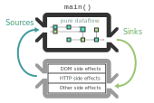
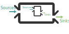
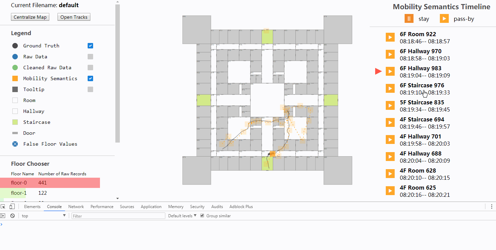

# 对 Cycle.js 的一些思考

[Cycle.js](https://cycle.js.org/) 是个不一样的框架。Cycle 完全使用响应式编程作为编程范式，框架的核心依赖于 xstream，而基于该框架的应用也必须从 xstream/most/RxJS 三个 Observable/Stream 库挑选一个。Cycle 拥抱函数式编程，应用代码不直接执行副作用，而是输出「描述对象」通知「驱动」来执行副作用。

Cycle 可以分为两个部分：

1. **定义部分：定义了应用的输入/输出格式，定义了「应用以 `run(App, drivers)` 的方式运行」**
2. 模块部分：@cycle/run 核心模块，提供 `run` 函数；以及 @cycle/dom、@cycle/http 等驱动模块。

这两个部分中，我个人认为**定义部分**较为重要。通过本文后面的分析，可以发现，从定义部分出发，模块部分的出现是非常合理的：官方模块提供了一些常用的 API 和副作用驱动，实现了不同 Cycle 应用都需要的共同功能。官方模块 @cycle/dom 提供了执行「更新 DOM 的副作用」的服务；而 @cycle/http 提供了执行 「HTTP 请求的副作用」的服务。

Cycle 对于应用的抽象如下：应用函数（*main*） 是一个纯函数，其中输入（*sources*）是来自外部的读副作用，输出（*sinks*）是对外部的写副作用。在程序外部的所有 I/O 副作用都是由驱动（*drivers*）管理，比如处理 DOM 副作用和 HTTP 副作用。




Cycle 与其他框架的不同点就在于输入和输出都使用「流」作为容器。下面我们就从不同方面来分析「流」的引入对应用开发思路的改变。（如果对流还不是很熟悉，可以看看 [xstream](https://github.com/staltz/xstream) 或 [RxJS](https://github.com/ReactiveX/rxjs) 的文档。）

## 用流定义应用输出

当应用运行之后，应用是不断变化的。对于前端页面应用来说，`window.document`，或者说真实 DOM 的状态是最重要的，因为它决定了页面上展现的内容，决定了用户看到的内容。我们将真实 DOM 看作一个流：在应用生命周期中任意一个时刻观察该流，我们可以看到真实 DOM 在此时刻上的状态；而如果从整个生命周期来看，这个流又像是一个数组，该数组按时间顺序记录了真实 DOM 的每一个状态。注意我们的容器是可以**跨越时间**的，虽然页面中只会存在一个 document 对象，但容器仍然记录了不同时间点 document 的状态。如果将整个应用看作一个函数，那么该函数的任务便是生成该 DOM 流。除了页面内容，一个页面也会有其他类型的输出，例如声音输出、通知输出等，我们将不同类型的输出称为「在不同 channel 上的输出」（sinks on different channels），此时我们的应用的任务变为了「为每个 channel 生成一个流」。

```TypeScript
interface NaiveSinks {
  DOM: Stream<Document>
  sound: Stream<Sound>
  notification: Stream<Notification>
  HTTP: Stream<HTTPRequest>
}
```

#### Virtual DOM 的引入

前面 DOM 字段对应的类型为 `Stream<Document>`，这意味着我们需要对 `window.document` 进行原地修改，然后在不同时刻将该对象 emit 出去，换句话说，我们需要手动维护真实 DOM。当页面复杂的时候，手动维护真实 DOM 既繁琐又容易出错，且副作用的引入以及对全局对象的依赖导致代码难以测试和理解。现在很多流行的框架（React、Vue）都引入了 Virtual DOM，Cycle 也一样，通过官方模块提供了 Virtual DOM。在引入了 @cycle/dom 模块之后，我们可以按照需求创建 DOM channel 的驱动，一般称创建的驱动为 `domDriver`。domDriver是一个函数，其接受一个虚拟文档对象（vdom）的流为参数，该函数的逻辑如下：每当 vdom 流 emit 一个 vdom 对象，该函数会负责调用相关 DOM API，将真实 DOM 修改为 此时 vdom 指定的状态。

引入 Virtual DOM 之后，应用可以避免陷入琐碎的 DOM 增删改查之中，而更专注于所要展现的内容本身。应用的任务从「生成真实 DOM 流」变为了「生成虚拟 DOM 流」。类似的，其他 channel 也需要有对应的驱动以执行副作用。一个 channel 的驱动往往是高度可复用的（例如 domDriver 的接口非常简单，但是通过该驱动，应用可以在页面上绘制任意的用户界面），大部分常见的 channel 的驱动已经有官方模块提供。

我们修改 Sinks 类型签名，如下：

```TypeScript
interface Sinks {
  DOM: Stream<VNode> // VNode是vdom的类型名称
  // 这里就暂时不考虑其他 channel 输出，例如 HTTP: Stream<HTTPRequest>
}
```

#### 从 run 函数的视角看应用输出

当我们的页面开始运行时，run 函数开始运行，其调用应用函数，拿到应用返回的 sinks，将 sinks.DOM 作为参数调用 domDriver 函数（其他 channel 的应用输出也类似）。这样，每当虚拟文档流 emit 一个 vdom 对象时，domDriver 都会对真实文档对象进行相应的更新，页面就会展示新的内容，所有的 DOM 副作用都在 domDriver 中执行，一切运行得相当完美。其他 channel 上的应用输出也是类似的流程。

## 用流定义应用输入

我们同样使用流来作为应用输入的容器。这里我们以前端应用中最常见的鼠标点击为例，使用流来抽象「所有的鼠标点击事件」是比较直观的，每当用户进行鼠标点击时，就会有一个 MouseEvent 对象在事件流中被 emit 出来，该对象包含了这次鼠标事件的所有信息，包括鼠标所点击的元素、鼠标的按键等。这些事件流将会作为应用的输入。

#### **谁来生成应用的输入？**

应用在某个 channel 的输入由「该 channel 相应的 driver 」进行提供。例如，鼠标点击事件、鼠标移动事件来源于真实 DOM，而真实 DOM 由 DOMDriver 进行维护，故这些鼠标事件流需要由 DOMDriver 进行生成。

这样我们的 DOMDriver 的大致函数签名如下：

```typescript
interface NaiveDOMDriver {
    (vdom$: Stream<VNode>): Stream<Event>
}
```

#### lazy & queryable

一个应用只会对满足特定条件的鼠标事件感兴趣，例如一个简单的计数器应用只对「+1」「-1」这两个按钮上的左键点击事件感兴趣。而对于 DOMDriver 来说，因为不知道具体的应用会对哪些事件感兴趣，所以该驱动仍然需要生成潜在的所有可能的事件流。生成一个「所有事件的流」显然是一种低效的做法，例如鼠标移动时 mousemove 事件产生的频率非常高，但大部分的应用从来不关心鼠标移动事件，如果驱动生成了这样一个鼠标移动事件流，那么该流很可能没有任何消费者。

DOMDriver 采取了性能更优的事件流生成机制，该机制有下面两个特性：

* lazy：事件流只在被需要的时候才进行构建；
* queryable：该机制允许不同应用根据需求以查询的方式来获取相应的事件流。

DOMDriver 并没有直接返回一个流对象，而是返回一个 DOMSource 对象。一个 DOMSource 可以代表「应用渲染得到的页面的一部分」

* 调用 `domSource.elements()` 可以获取页面中 DOM 节点流
* 调用 `domSource.events('click')` 可以获取该页面部分中点击事件流
* `domSource.select('some-css-selector')` 表示执行 CSS 选择器以选取页面的部分子结点，该函数返回一个新的 DOMSource 对象，该对象代表了范围缩小之后的页面元素。

应用获取到 DOMSource 之后，根据实际需求调用其 API 来获取所需要的事件流。至此，应用输入输出和 DOMDriver 相关接口类型定义如下：

```TypeScript
interface Sources {
  DOM: DOMSource
}

interface Sinks {
  DOM: Stream<VNode>
}

interface DOMDriver {
  (vdom$: Stream<VNode>): DOMSouce
}
```

#### 从 run 函数的视角看应用与驱动

从上面的类型定义可以看出，应用的 DOM channel 与 DOMDriver 恰好构成一个循环（*cycle*，这也是 Cycle.js 名字的由来），一方的输入恰好是对方的输出。而我们的框架核心，也就是 run 函数，代码大致如下：

```typescript
// 我们往往这样调用run函数
// run(App, { DOM: makeDOMDriver('#app') })

function run(App, { DOM: domDriver }) {
  // 新建一个vnode代理，「假装」虚拟文档流已经获取
  const vnodeProxy$ = xs.create()
  
  const domSource = domDriver(vnodeProxy$)
  const sinks = App({ DOM: domSource })

  // 让代理模拟 应用函数返回的虚拟文档流，也可以认为是「用应用返回的vnode流替换刚才假冒的代理」
  vnodeProxy$.special_imitate(sinks.DOM)
}
```

上面的 run 函数可以认为是 @cycle/run 模块提供的 run 函数的简化版。实际版本比较复杂，且可以处理所有 channel 上的输入输出，简化版本只考虑了 DOM channel。

## 重新回顾

从上面的分析可以看出，如果我们基于 Cycle 的定义来开发前端应用，那么 @cycle/run 和 @cycle/dom 提供的功能正式我们需要的。

## 优美特性

Souces 和 Sinks 是 Cycle 应用和驱动之间的接口，同时也是父组件和子组件之间的接口。每一个 Cycle 应用都可以像下面这样，成为另一个应用的子组件。



基于 Cycle 对应用的定义，Cycle 中组件和应用并没有多大的区别，而组件也只是一个输入流到输出流的映射函数而已。所以如果一个函数符合 Sources 和 Sinks 的接口，那么具有下面这样优美的特性：「函数即为组件，组件即为应用」。

## 一个简单的计数器例子

定义了应用的输入和输出之后，我们就可以写代码来实现具体的应用了，下面是一个简单的、用 Cycle 实现的计数器应用。注意该例子中所有函数都是纯函数，所有的变量都保持了 [immutable](https://en.wikipedia.org/wiki/Immutable_object)。

该例子有一个[在线版本](https://stackblitz.com/edit/simple-cycle-counter-app?embed=1&file=CounterApp.js)，不过在线版本因为网站限制并没有使用 TypeScript 而使用了 JavaScript。

```typescript
// CounterApp.tsx
import xs, { Stream } from 'xstream'
interface Sources { DOM: DOMSource }
interface Sinks { DOM: Stream<VNode> }

function CounterApp(sources: Sources): Sinks {
  const domSource = sources.DOM
  const clickDecButton$ = domSource.select('.dec').events('click')
  const clickIncButton$ = domSource.select('.inc').events('click')

  const dec$ = clickDecButton$.mapTo(-1)
  const inc$ = clickIncButton$.mapTo(+1)
  const change$ = xs.merge(dec$, inc$)
  const count$ = change$.fold((oldCount, delta) => oldCount + delta, 0)

  const vdom$ = count$.map(count =>
    <div className="simple-counter">
      <button className="dec"> -1 </button>
      <p>Count: {count} </p>
      <button className="inc"> +1 </button>
    </div>
  )

  return { DOM: vdom$ }
}
```


<hr />

Cycle 的内容较少，本文前面的部分就已经介绍了 Cycle 的大部分内容。Cycle 只规定了应用的输入和输出格式，但并没有限定应用如何去管理状态和数据，开发者可以选择自己喜欢的方式来进行状态管理。下面的部分就讲讲我对 Cycle 状态管理的一些思考总结。

## 状态管理

将输入直接映射为输出是困难的，即使是计数器这样比较简单的应用，我们也需要一些中间步骤和中间状态，才能实现整个应用。状态管理涵盖了「状态存储」，「生命周期管理」，「状态变更方式」，「状态作用域/状态传递」几个方面，是应用开发中非常重要的一环。

#### React/Redux 中的状态管理

我们先来看看流行的框架/类库是如何管理状态的（我比较熟悉 React 和 Redux，所以这里主要说这两个）。React/Redux 提出了不同的方式来解决状态管理问题，不过两者都使用了更偏向于面向对象的方式：以某个对象为容器，状态保存在容器中。

* 状态存储：React 中用组件实例的 state 字段来记录该实例的内部状态，代码中使用 `this.state` 来获取状态；而 Redux 则用全局的 store 存放应用的全局状态，外部使用 `store.getState()` 方法来获取状态。
* 生命周期管理：React 中状态的生命周期与组件实例生命周期一致，一个组件实例被创建时，一份组件状态会被初始化，一个组件实例被销毁时，一份组件状态也同时被销毁；Redux 中 store 是单例，store 在整个应用生命周期中存在且仅存在一个。
* 状态变更方式：React 中我们往往手动调用 `setState` 来进行变更状态，且使用 `setState` 后会触发组件的 re-render；Redux 中我们需要将变更用 Action 对象封装（Action 对象一般来说是包含 type 字段的普通 JavaScript 对象，该对象也包含其他可选的字段用于描述应用所要进行的操作），然后在 reducer 中实现状态变更逻辑。
* 作用域/状态传递：React 中组件实例的状态只对组件实例本身可见，状态也只能由组件实例调用 `this.setState`  来进行修改。组件实例也可以将状态以 props 的方法传递给子组件，而要让子组件也能修改组件实例的状态，需要将包含 `setState` 的回调函数传递给子组件。在Redux中，状态是全局状态，对整个应用都是可见的。

在 React/Redux 中 `reactInstance.state` 或是 `store.getState()` 只能表达 **「某个时刻的状态」**，为了使得页面内容不断发生变化，这些状态对象也必须不断更新。React/Redux 对状态变更都是比较谨慎的：React 不推荐应用直接修改 state 对象，而 Redux 更是要求我们必须将修改操作封装为 Action 对象。

#### Cycle 中的状态管理

现在不一样的是，我们有了 Stream 这个容器，一个变量就可以表达 **「整个应用生命周期中某个状态的所有值」**。充分利用 Stream 容器和 JavaScript 的函数特性，我们可以做得更简洁：「一个组件就是一个函数，函数的局部变量便是组件的状态」。函数局部变量本身具有的特性和组件状态管理配合默契：

* 生命周期管理：
  * 创建：「组件实例加载时状态初始化」对应于「函数被调用时局部变量被创建」
  * 销毁：「组件实例卸载时状态销毁」对应于「函数调用结束且外部不局部变量被回收」（这里更严谨的说法是：调用组件函数，返回组件实例的输出流，当输出流不再被其他对象引用时，局部变量指向的对象将被回收。）
* 状态作用域：「函数局部变量仅在函数内可见」对应「组件实例的状态仅对实例本身可见」，如果想让「子组件共享父组件的状态」，那么只需「将父组件中的局部变量以函数参数的方式传递给子组件」即可。
* 状态存储：局部变量使用语言本身的机制进行存储
* 状态变更方式：响应式编程（见下方）

而在 Cycle 中，用来存放组件状态的局部变量和其他局部变量并没有任何差别，我们可以用局部变量来表达任何可以表达的内容：「状态流」、「redux Action 对象流」、「事件流」、「HTTP 响应流」。例如在上面的计数器的例子，CounterApp 就用到了 dec$ / inc$ / change$ / count$ 等若干个流。得益于 Stream 容器强大的表达能力，即便采用基本的「将状态保存到函数局部变量上」的方式，我们的应用也可以应对非常复杂的情况。

#### 流与依赖关系（响应式编程）

当我们使用流来表达应用的状态时，响应式编程便开始发挥作用。让我们再来看一看计数器例子中部分流的创建代码：

```typescript
const dec$ = clickDecButton$.mapTo(-1) // LINE 1
const inc$ = clickIncButton$.mapTo(+1) // LINE 2
const change$ = xs.merge(dec$, inc$) // LINE 3
const count$ = change$.fold((oldCount, delta) => oldCount + delta, 0) // LINE 4
const vdom$ = count$.map(count => ... // LINE 5
```

上面的代码创建了若干个流，且「流的创建代码」中包含了「流的依赖关系」。

* 从 LINE 1 中我们可以看出「减一操作流」依赖于「点击减一按钮的事件流」（LINE 2 同理）；
* LINE 3 表明了「状态修改流」依赖于「减一/加一操作流」；
* LINE 4 则表明了 count 依赖于「状态修改流」；
* 最后 LINE 5 则表示应用的视图依赖于应用的状态。

函数中的各个数据流/事件流的依赖关系被显示写了出来，具体的流的计算规则由实际业务需求决定。

应用运行的时候，每当输入流 emit 一个新的值，依赖于输入流的各个流都会得到「响应」（根据流被创建时的规则计算得到该流需要 emit 的值），而依赖于输入流的流可能又被其他流所依赖，这个响应的过程会不断进行，直到所有流完成响应。

例如在计数器应用中，用户每点击一次「+1」按钮，clickIncButton\$ 就会 emit 一个 MouseEvent 对象，而依赖于 clickIncButton\$ 的 inc\$ 流中会根据流创建时指定的规则 emit「+1」。change\$ 合并了 inc\$ 与 dec\$，inc\$ emit 一个「+1」时，change\$ 也会 emit 一个「+1」。count\$ 流会将 +1 和原先的 count 值相加，生成新的 count 值并 emit 出来，最后 vdom\$ 会根据 count 的变化而 emit 新的 vdom 对象，框架中的 domDriver 会得到新的 vdom 对象并更新页面的真实 DOM。

> 响应式编程提高了代码的抽象等级，使得代码更专注于业务逻辑中不同事件流的互相关系，而不用总是陷在一大堆琐碎的具体实现上。 来自 ["Why should I consider adopting RP?"](https://gist.github.com/staltz/868e7e9bc2a7b8c1f754#why-should-i-consider-adopting-rp)

计数器的例子中，count\$ 依赖且仅依赖于 change\$，而不依赖于具体的点击事件或是具体的页面内容；我们创建 count\$ 的时候，不需要关心页面上的内容，不需要关心用户点在了哪个按钮上面，我们只需要了解「 这儿有一个 change\$ 记录了所有 count 的变化」以及「 count 的初始值为 0」更足够了。计数器的例子比较简单，而下面这个较为复杂的例子可以让我们看到响应式编程带来的抽象级别的提升。

#### 例子：轨迹查看器



[轨迹查看器](http://shinima.pw/viewer/)对聚类前后的室内定位数据进行了可视化。这里我们关注轨迹查看器的地图居中功能，该居中功能大致如下：

* 页面大小发生变化时，居中显示地图
* 点击左上角的 *Centralize Map* 按钮，居中显示地图
* 从右侧的 *Mobility Semantics Timeline* 中点击其他楼层的轨迹时，居中显示轨迹
* 页面第一次打开时，居中显示地图，但不使用过渡动画（其他三种情况都使用过渡动画）

用回调函数的方式来实现上述功能是非常繁琐的，而在这里适当地应用响应式编程可以大大简化编码。这里我们从结果为导向来整理实现思路：

1. 因为最后的效果是要对地图进行缩放，且还要指定是否使用 transition，根据 D3 的 API 文档，我们使用这样的一个对象来描述所「期望的缩放行为」： `{ useTransition: boolean; targetTransform: d3.ZoomTransform}`
   1. `useTransition` 比较容易计算，第一次加载地图该值为 false，其他时候均为 true
   2. `targetTransform` 可以通过 `viewBox` 和 `contentBox` 来计算得到。
      1. `viewBox` 和居中对象无关，直接通过获取 SVG 元素的大小就可以计算得到。
      2. `contentBox` 和居中的对象相关，居中地图时我们需要获取楼层地图的大小，而居中轨迹时，我们则需要根据具体的轨迹 ID 来获取对应的轨迹的外接矩形的大小。

整理好思路之后，我们还需要注意两点：

1. 因为我们需要表示应用运行过程中「**所有的**地图居中和轨迹居中」，所以我们需要正确地用 Stream 容器将这些对象包装起来。
2. 刚才的思路是反过来的，而具体代码是正的。

具体代码大致如下：

```javascript
// 注意该文件中代码执行了副作用；不过该文件并不是 cycle 的应用代码；
// 本文件中还请更多关注「变化的传播」 (●ˇ∀ˇ●)

// 地图居中信息流  其中的信息包含 useTransition, contentBox 这两个字段
const mapCentralizeInfo$ = xs
  .merge(
    // 楼层居中来自于下面三种情况：
    // 1. 第一次楼层地图加载映射为 false（表示不使用 transition）
    floor$.take(1).mapTo(false),
    // 2. 将去抖之后的「网页窗口大小改变事件」映射为 true
    resize$.compose(debounce(200)).mapTo(true),
    // 3. 用户点击了居中按钮
    centralizeMap$.mapTo(true),
  )
  .compose(sampleCombine(svg$))
  .map(([useTransition, svg]) => {
    const regionLayer = svg.selectAll('*[data-layer=region]').node()
    const contentBox = regionLayer.getBBox() // 此时楼层地图的大小
    return { useTransition, contentBox }
})

// 轨迹居中信息流
const traceCentralizeInfo$ = traceToCentralize$
  .compose(sampleCombine(svg$))
  .map(([trace, svg]) => {
    // 根据 traceIndex 来获取该轨迹的大小
    const traceNode = svg.select(`*[data-trace-index="${traceIndex}"]`).node()
    const contentBox = traceNode.getBBox()
    return {
      useTransition: true,
      contentBox,
    }
  })

xs
  // 合并「地图居中信息流」和「轨迹居中信息流」
  .merge(mapCentralizeInfo$, traceCentralizeInfo$)
  .compose(sampleCombine(svg$))
  .addListener({
    next([{ useTransition, contentBox }, svg]) {
      const svgNode = svg.node()
      const viewBox = { width: svgNode.clientWidth, height: svgNode.clientHeight }
      const targetTransform = doCentralize(contentBox, viewBox)
      if (useTransition) {
        zoom.transform(svg.transition(), targetTransform)
      } else {
        zoom.transform(svg, targetTransform)
      }
    }
  })
```

上述代码中，我们通过组合已有的流（例如楼层地图的数据流，用户点击按钮的事件流等），使用不同的流操作符（map/mapTo/merge等），得到若干中间状态流（地图居中信息流和轨迹居中信息流），然后合并这些中间流并添加居中地图的监听器。每一个流的创建代码都包含了其所依赖的其他流，我们可以从流的创建代码中清晰地看到流之间的依赖关系。随着流的不断创建，代码的抽象级别也相应提高，到最后我们得到了这样一个流，通过该流可以方便地计算「期望的缩放行为」，恰好对应前面实现思路中的第一行。

## 总结与一些其他感想

本文介绍了 Cycle 对于应用输入/输出的定义，并围绕该定义分析了 Stream 容器的引入对应用开发带来的思路转变，探究了 Cycle 官方模块出现的原因以及其作用。Cycle 并没有限制开发者如何去管理应用的状态，本文通过对比和举例的方式，介绍了一些我个人在日常开发中采用的状态管理方式。Cycle 拥抱响应式编程，如果能够合理地构建数据流，并清晰地抽象代码，基于 Cycle 可以实现交互/逻辑非常复杂的应用。

最近一些日子我主要使用 Cycle 实现了[一个简易的 SVG 编辑器](https://github.com/shinima/editor)，切身体会到了响应式编程对于实现复杂交互的强大能力。不过，Cycle 也存在着许多的「坑」，这几个月我也被坑过不少回：

* Stream 都是 lazy 的，如果一个流没有消费者，那么该流不会 emit 任何对象。在依赖关系复杂的应用中，「某个组件的某个 channel 处理错误」就可能导致「整个应用无法运行」，因为其他所有流都可能直接或间接依赖于出错的那个流。
* `Stream<T>` 容易理解；而 `Stream<Stream<T>>` 或是 `Array<Stream<T>>` 则较为晦涩难懂。然而在较为复杂的应用中，嵌套的流或是流的列表出现频率很高，维护这些数据结构有着较高的学习门槛（好在学会之后也不觉得太难）。在这个 [GitHub issue](https://github.com/cyclejs/cyclejs/issues/312) 中 Cycle 作者也讲到处理列表是非常棘手的一件事，该 issue 中也列举了处理列表的若干方式。
* 调试体验较差。抛出异常的堆栈缺乏有效信息，有的时候完全不知道自己错在哪里。

总体而言，Cycle 是一个不太一样的框架，有一定的学习门槛，但代码实践中也充满了乐趣。Cycle 拥抱响应式编程，也许直接采用 Cycle 框架脱离了实际需求，其响应式的开发思想也值得一学。