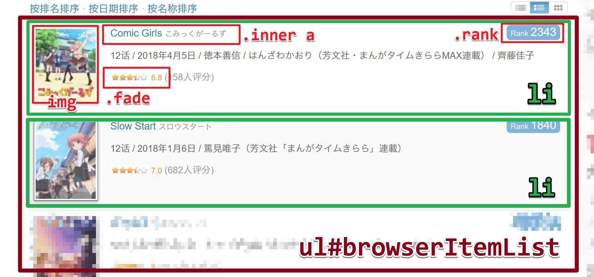

# vscode-temme：快速抓取网页中的数据

从名字上也可以看出来，[vscode-temme](https://marketplace.visualstudio.com/items?itemName=shinima.vscode-temme) 是 [temme](https://github.com/shinima/temme) 的 [vscode](https://code.visualstudio.com/) 插件，用来从 HTML 文档中抓取 JSON 数据，大致运行效果如下图所示。

上图展示了使用该插件来抓取[芳文社番剧列表](http://bangumi.tv/anime/tag/%E8%8A%B3%E6%96%87%E7%A4%BE/?sort=date)的整个过程。抓取结果为一个列表，每个列表元素包含了 id、番剧名称、图片链接、评分等信息。下图展示了网页的页面结构和对应的 CSS 选择器，这些选择器也都出现在了temme 选择器中。两张图片对照着看，可以更容易理解图中各个选择器的含义。

